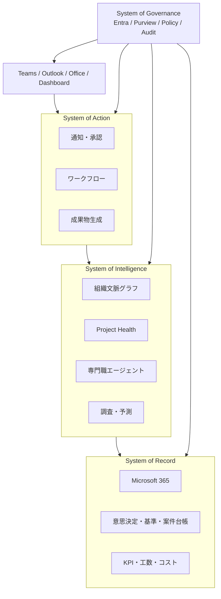

# 全体アーキテクチャ

## 配置方針

- Teams / Microsoft 365 Copilot: 利用者の主要インターフェース
- Microsoft Graph: M365情報への権限付きアクセスと変更通知
- Entra ID: 認証、グループ、ロール、PIM、ID Governance
- Purview: ラベル、DLP、監査、保持、eDiscovery
- Azure Functions / Container Apps: イベント処理とAPI
- Service Bus / Event Grid: 疎結合な非同期処理
- Azure SQL / Dataverse: 構造化された業務状態
- Azure AI Search: キーワード＋ベクター＋メタデータ検索
- Microsoft Foundry / Copilot Studio: 高度AIとM365ネイティブエージェント
- Fabric / Power BI: 分析とダッシュボード
- Azure Monitor / Application Insights: OpenTelemetryによる観測

## Fast Path

期限計算、工数集計、権限判定、状態遷移、必須項目検証はAIを呼ばず処理する。曖昧な文脈理解、仮説、意味差分、文章生成だけをAIへ渡す。

## 外部連携

外部の人、SaaS、API、公開WebはExternal Collaboration & Integration Zoneを経由し、認証、検疫、分類、スキーマ検証、監査を行ってから内部へ昇格する。
